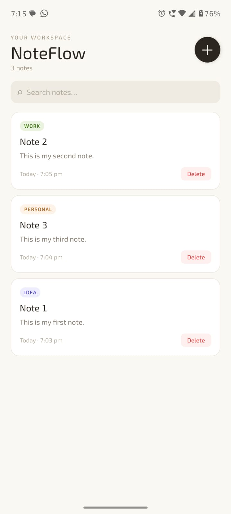
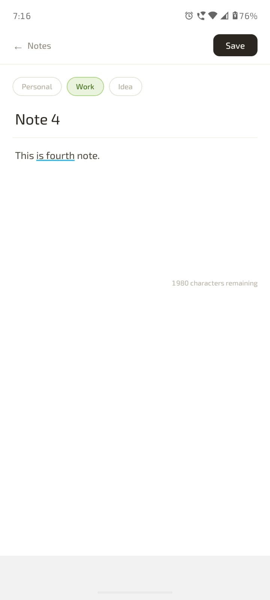

# 📝 NoteFlow

> An offline-first notes app built with React Native and Expo — clean, fast, and works without internet.


---

## 📌 Overview

NoteFlow is a minimal, well-considered notes application that works entirely offline. Notes are stored locally on the device and persist across restarts — no backend, no cloud sync, no internet required.

Built as part of a React Native Mobile Engineering shortlist task, the goal was to deliver something that feels like a real product: not over-engineered, but not a raw prototype either.

---

## 📲 APK Download

Install and run in under 5 minutes:

**[⬇️ Download APK](https://expo.dev/accounts/ishant212/projects/noteflow/builds/fe130f1b-28b0-46b5-839c-b0b497262780)**

> Enable "Install from unknown sources" in your device settings before installing.

---

## ✨ Features

### Notes Management
- Create new notes with a title and body
- Edit existing notes
- Delete notes with a confirmation dialog
- Notes automatically sort by most recently updated

### Offline-First Storage
- Works entirely without internet
- Notes persist locally using AsyncStorage
- Data survives app restarts and device reboots

### Search & Categories
- Real-time search across all notes
- Tag notes with categories: **Personal**, **Work**, **Idea**
- Filter notes by category directly from the list screen
- Filters work alongside real-time search

### Mobile UX
- Keyboard-aware editor so the toolbar never hides behind the keyboard
- Safe area handling on notched devices
- Floating action button (+) for quick note creation
- Character limit counter in the editor
- Timestamps shown on each note (created / last updated)

---

## 🔒 Reliability & UX Improvements

- Added visible toast feedback for save/delete operations (success and failure)
- Added AsyncStorage failure handling with `try/catch` to prevent silent data loss
- Save button now shows a loading state (`Saving...`) and disables during persistence — prevents navigating away before the write completes
- Added category-based filtering on the notes list screen
- Improved overall offline reliability and user trust

---

## 📸 Screenshots

| Notes List | Create / Edit Note |
|---|---|
|  |  |

---

## 🗂 Folder Structure

```
NoteFlow/
│
├── assets/
│   ├── icon.png
│   ├── splash-icon.png
│   ├── NoteList.png          ← Screenshot
│   └── NoteCreate.png        ← Screenshot
│
├── screens/
│   ├── NotesListScreen.js    ← Home screen, search, category filter
│   └── EditNoteScreen.js     ← Create / edit note form
│
├── storage/
│   └── notesStorage.js       ← AsyncStorage read/write helpers
│
├── App.js                    ← Navigation setup
├── app.json
├── eas.json
├── package.json
└── README.md
```

---

## 🛠 Tech Stack

| Technology | Role |
|---|---|
| React Native | Core framework |
| Expo SDK 54 | Build toolchain & native APIs |
| React Navigation (Native Stack) | Screen navigation |
| AsyncStorage | Local persistence |
| react-native-safe-area-context | Safe area / notch handling |
| KeyboardAvoidingView | Keyboard-aware layout |

---

## 🚀 How to Run Locally

### Prerequisites

- Node.js 18+
- Expo CLI (`npm install -g expo-cli`)
- Expo Go app on your phone, or an Android emulator

### Steps

```bash
# Clone the repo
git clone https://github.com/ishant212/noteflow
cd noteflow

# Install dependencies
npm install

# Start the dev server
npx expo start
```

Scan the QR code with Expo Go (Android) or run in an emulator.

---

## 💾 Storage Decision

NoteFlow uses **AsyncStorage** for local persistence.

AsyncStorage is the standard key-value store for React Native apps that need simple offline persistence without a query layer. For a notes app with flat data (each note is a self-contained JSON object), it is the right fit — no schema migrations, no setup overhead, no native compilation required. The alternatives considered were SQLite (overkill for flat, non-relational data) and MMKV (faster, but adds a native module with no meaningful benefit at this data scale). AsyncStorage ships with Expo, works out of the box, and is sufficient for the scope of this application.

---

## ⚠️ Known Limitations

- **No cloud sync** — notes live only on the device they were created on
- **No conflict resolution** — editing the same note on two offline devices and syncing is not handled (by design, per scope)
- **In-memory list** — the full notes array is loaded at startup; this is fine for hundreds of notes but would need pagination at scale

---

## 👤 Author

**Ishant Shekhar Eeshu**   
[GitHub](https://github.com/ishant212)

---

> Built for the Mobile Engineering shortlist task. Designed to be offline-first, clean, and defensible.
